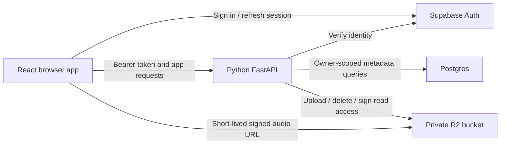

# Audio app: product and implementation plan

Status: accepted by the project owner on 2026-09-11, with the upload limit changed
to 100 MiB in PR #8. Baseline: merged `main` at `4abe585` (PRs #1–#7).
The provider choices and release scope below are agreed implementation direction.
This document supplies the shared direction; task briefs select one part of it.

## 1. Product goal and release boundary

A user signs in, uploads an audio file, sees it in their private library, plays and
seeks through it, and can delete it. The library survives refreshes and backend
restarts. Another user cannot list, play, or delete their recordings.

The first release is usable locally with development services. Hosting is a later
explicit milestone. Audio processing follows a working original-audio library.
Keep original bytes intact so a future processor can create separate outputs.

Included: one sign-in method, personal library, one-file uploads, playback, delete,
loading/empty/error states, ownership enforcement, and tests of the complete flow.
Excluded: sharing, teams, editing, waveforms, batch uploads, subscriptions, multiple
auth providers, and background processing infrastructure.

## 2. Agreed decisions

| Decision | Agreed choice | Reason / consequence |
| --- | --- | --- |
| First release | Private library before processing | Gives future audio operations a real input/output workflow |
| Auth | Supabase Auth; email OTP for development | One browser session flow; Python validates its access token |
| Database | Supabase Postgres, accessed by Python | Auth and database can use one project; metadata ownership stays in the API |
| Audio storage | Private Cloudflare R2 bucket | Matches the intended storage integration; original bytes stay outside Postgres |
| Upload path | Browser → Python → R2 | One authenticated request can enforce size/content rules without an upload-finalization protocol |
| Playback path | API grants a short-lived signed R2 GET URL | Browser media player reads/seeks directly; API still authorizes each grant |
| Initial formats/limit | PCM WAV and MP3, at most 100 MiB (104,857,600 bytes) per file | Limit applies to file bytes; request limits must also allow multipart overhead |
| Hosting | Decide after the local library works | No host-specific infrastructure in the first implementation round |

Email OTP needs development email delivery configured (or a local mail capture
setup); do not treat arbitrary test-user delivery as already provisioned. Confirm
the Supabase project's signing-key mode before implementing verification. No
credentials have been inspected or any cloud resources provisioned for this plan.

Supabase supports email OTP and managed user sessions. Its JWKS endpoint supplies
public keys for asymmetric signing; legacy shared-secret projects need a different
verification path. Use the provider's documented verification approach and a
maintained JWT library, checking signature, issuer, audience, expiry, and subject.
[Email OTP](https://supabase.com/docs/guides/auth/auth-email-passwordless),
[JWT verification](https://supabase.com/docs/guides/auth/jwts).

## 3. What round one delivered

| Existing code | What works today | What the next meaningful slice must connect |
| --- | --- | --- |
| `app/auth.py` — PR #6 | `VerifiedIdentity`, `IdentityVerifier`, typed auth failure | A real verifier and credential extraction in HTTP dependencies |
| `app/db.py` — PR #7 | `AudioRecord`, create/get contract, in-memory adapter | Postgres persistence and owner-scoped list/get/delete operations |
| `app/storage.py` — PR #4 | Byte-oriented storage protocol and in-memory adapter | R2 upload/delete and authorized signed playback access |
| `app/routes/tracks.py`, `tracks.py`, `schemas.py` — PR #5 | `GET /tracks`, tested with dependency overrides | Real identity and repository; defaults currently reject access |
| `front-end/src/components/AudioLibrary.tsx` — PR #3 | Accessible empty-state presentation | Session state, real API data, upload and media controls |
| Foundation | Health endpoint, checks, CI, worktree guidance | Continue using these throughout feature work |

The main mismatch is concrete: `TrackReader.list_tracks(user_id)` returns a `Track`
with duration, while `AudioRepository` only has create/get and `AudioRecord` has
owner/object key but no duration. These can be reconciled inside the persistent
library PR. A separate interface-only cleanup PR is not needed.

The existing tests demonstrate component behavior with fakes. They do not establish
that a user can sign in, persist metadata, or access R2. Retain useful tests and
adapters; expand them as real behavior is connected.

## 4. Architecture and responsibility

The verification arrow includes fetching/caching public keys; it need not mean a
network request for every API call. The browser uses the provider SDK for session
management and sends the current access token to Python. It never receives the
database password or R2 API credentials. Sign-out clears the visible library and
player; a 401 triggers reauthentication rather than an endless retry loop.

Python is the app's authorization boundary. Derive owner identity from the verified
token, never from request JSON. Every metadata operation is scoped to that owner.
Return 404 for another user's track just as for a missing track. Database queries
must enforce the scope; filtering a full result set in the browser is insufficient.
Evolve the current unscoped `get_by_id` boundary into owner-scoped retrieval for
HTTP consumers, with the same owner requirement for list and delete operations.

Use one concrete Postgres adapter, initially with explicit SQL and a maintained
Python driver. Keep the track table in an application schema not exposed through
the browser Data API, and use a restricted backend database role. With direct SQL,
do not assume Supabase automatically supplies `auth.uid()` from the API request.
Any exposed tables require appropriate grants/RLS; privileged roles can bypass
RLS. Two-user isolation tests are required regardless of adapter choice.
[Connections](https://supabase.com/docs/guides/database/connecting-to-postgres),
[RLS behavior](https://supabase.com/docs/guides/database/postgres/row-level-security).

Presigned R2 URLs are temporary bearer capabilities: someone with the URL can use
it until expiry. Use five-minute playback grants, no public bucket, and no URL
logging. Configure bucket CORS for the frontend's allowed origins and media access.
If an expired URL breaks playback/seek, request a fresh grant and restore position
once; show a recoverable error if that fails. Signing out does not instantly revoke
an already-issued URL; that five-minute access window is part of the agreed design.
[Signed URLs](https://developers.cloudflare.com/r2/api/s3/presigned-urls/),
[Bucket CORS](https://developers.cloudflare.com/r2/buckets/cors/).

## 5. Shared data and API direction

Use **track** as the user-facing/API resource, retaining the existing `/tracks`
route. A persistence record and a response DTO may differ, but their mapping must
be explicit. Extend the existing record and read adapter in the PR that uses them;
do not add another competing repository hierarchy.

| Track field | Meaning / rule |
| --- | --- |
| `id` | Server-generated UUID; stable resource identity |
| `owner_id` | Verified auth subject; stored as opaque text; never client-assigned |
| `title` | Display title, initially derived from the filename |
| `object_key` | Unique server-generated R2 key, e.g. `originals/<track-id>`; private metadata |
| `original_filename` | Sanitized display filename, never a storage path |
| `content_type` | Backend-determined supported media type |
| `size_bytes` | Actual accepted file size, positive and within the limit |
| `duration_seconds` | Parsed duration, positive; never invent a duration of zero |
| `created_at` | Database timestamp in UTC |

M1 needs id, owner, title, duration, and creation time for listing; M2 adds the
upload-specific fields and constraints in its migration. Reconcile the existing
record's required object key when implementing M1 rather than inventing fake keys.
Remove development-only seed rows before applying M2's required storage fields;
there is no user-created audio to migrate before uploads exist.
Use an owner/creation-time index; list newest first, with ID as a stable tie-breaker.
Do not persist signed playback URLs.

| Endpoint | Success | Milestone |
| --- | --- | --- |
| `GET /health` | Existing `200 {"status":"ok"}` | Already present |
| `GET /me` | `200 {"id":"<verified-subject>"}` | M1 |
| `GET /tracks` | Existing array shape: `[{id,title,duration_seconds}]`; owner-scoped, `[]` when empty | M1 |
| `POST /tracks` | Multipart `file`; `201` with the same track summary | M2 |
| `GET /tracks/{id}/playback` | `200 {"url":"…","expires_at":"<UTC timestamp>"}` after ownership check | M2 |
| `DELETE /tracks/{id}` | `204` when removal is complete | M3 |

Keep the current FastAPI `detail` convention. Use 401 for missing/invalid credentials,
404 for missing/not-owned tracks, 413 for oversize files, 415 for unsupported media,
400 for malformed supported audio, and 503 for an unavailable dependency. Normal
request-schema validation may return 422; the client must handle both string and
structured `detail`. Translate errors deliberately and avoid leaking provider details.
An auth provider/key-service outage is a dependency failure, not proof that the
user's token is invalid; preserve that distinction in verifier errors and tests.

The listing response remains minimal for this release. Pagination becomes a
separate feature when library size requires it. Preserve the existing API shape
unless a concrete UI need justifies a reviewed contract change.

## 6. Milestones and completion evidence

### M1 — I can sign in and see my persistent library

Implement real auth verification, `/me`, owner-scoped Postgres listing, session
handling, and the existing library UI's API integration. The UI must distinguish
loading, empty, signed out, and unavailable states. Configure frontend/API CORS.

Acceptance: a development user signs in, `/me` identifies them, and `/tracks` reads
Postgres. A test fixture for user A appears only for A, never for user B. A fresh
user sees an empty library. Refresh and backend restart preserve the result.
Expired/invalid/wrong-issuer tokens are rejected; database outage shows an error.
Use seeded rows only for this milestone's verification, not a public metadata-only
creation endpoint or a production fake repository.

### M2 — I can upload and listen to my own audio

Add validated upload, R2 persistence, track creation, authorized playback grants,
and the browser upload/player flow. Upload one file at a time. The backend enforces
the 100 MiB file limit while reading, including requests without a trustworthy
Content-Length. Use temporary/spooled storage and bounded reads; do not materialize
an entire 100 MiB upload in memory. Choose a media parser as part of
this feature, derive duration/type, and reject malformed or unsupported input.

Reuse `ObjectStorage` where it fits. Its `bytes` interface may need a file/stream
input for upload; signed read access is a separate needed capability. Introduce
those changes with the R2 consumer/tests, not as speculative protocol PRs.

Write the object under a unique key, then create metadata. On metadata failure,
attempt object cleanup and record a retriable cleanup failure if necessary. A
process crash can still leave an orphan: include a development reconciliation
command comparing old R2 objects to metadata, with a grace period and dry-run mode.
Do not pretend Postgres and R2 share a transaction. Failed uploads must not create
playable library rows. Retrying an upload may create a duplicate in this first
version; document this and avoid automatic client POST retries.

Acceptance: valid WAV and MP3 uploads appear immediately and play/seek after refresh
and restart. A second user cannot obtain playback grants. Test oversized, malformed,
and unsupported files; R2 failure; metadata failure and cleanup; expired playback
URLs. Verify that a valid file at 104,857,600 bytes is accepted and one byte more is
rejected, including streamed requests; multipart overhead does not count as file
bytes. Verify seeking against real R2 in supported browsers, not just mocked URLs.

### M3 — I can remove an audio file reliably

Add owner-scoped deletion and UI state. Delete R2 content before metadata; if R2
fails, retain metadata for retry. An already-missing object permits metadata cleanup.
If database cleanup fails after object removal, show failure and allow retry;
do not claim success. Missing/not-owned tracks return 404, including repeated deletion.

Acceptance: the row disappears after success, storage is gone, and refresh does not
restore it. Cross-user deletion is rejected. Test storage/database failure and retry.
The full sign-in → upload → play/seek → delete flow now works against development
services and is the first usable release. All three milestones include their own
validation and authorization; these are not deferred to a final hardening phase.

### Later — share the app, then add one processing operation

For hosting, choose a Python-capable service, frontend origin, migration execution,
and secret configuration based on the working app. Require HTTPS, correct origins,
upload limits/timeouts, error visibility, and a reproducible deployment smoke check.
Do not select a host or provision paid resources in the current planning task.

For processing, select one useful operation with an audible/visible result. Store a
derived output alongside the immutable original and let the user compare them.
Choose execution/job handling from that operation's actual runtime and resource
needs. No generic job queue, worker fleet, or processing plugin system beforehand.

## 7. PR sequence and useful parallel work

PRs are review units within a milestone. A backend capability can be a valid PR
when its next consumer is named and it works with real dependencies. A milestone
is complete only after the combined user journey is demonstrated. There is no line
count target; split when it improves reasoning or isolates a meaningful dependency.

| Planned PR | Concrete result | Lead / collaborators | Dependency |
| --- | --- | --- | --- |
| M1-A: authenticated identity | Valid provider token succeeds at `/me`; invalid tokens fail | Auth lead; API review | Provider/sign-in decision and dev project |
| M1-B: persistent private listing | Existing `/tracks` reads owner-scoped Postgres rows; reconciles the two metadata contracts | DB lead; API integration support | Can develop beside A; final integration requires A |
| M1-C: sign-in and library UI | Real session, sign-out, listing, and useful error states | Frontend lead; Auth/API handoffs | Mock during development; demo after A+B |
| M2-A: upload and playback backend | Real audio stored with metadata and playable through authorized R2 grants | API lead with R2 collaboration | M1; chosen formats, bucket, access model |
| M2-B: upload and player UI | User uploads, sees the result, and plays/seeks it | Frontend lead | Can develop alongside A against agreed requests; finish with A |
| M3: deletion across UI/API/storage | User can remove their own audio with retry-safe failure behavior | One feature owner; DB/R2 review | M2 |

M2-A contains related storage and API work because storage's reason to exist is that
flow. If it is too large to review, split at a usable backend upload endpoint and a
usable playback endpoint, each with real integration evidence and its UI consumer
scheduled next. Do not split out empty scaffolding to keep all five agents busy.

For M1, Auth, DB, and Frontend are the three primary implementation streams. API
helps settle contracts and performs integration; R2 can review the planned storage
flow, then implements during M2. One agent owns each PR even when another contributes
design or review. Specialist names are capabilities, not permanent silo boundaries.

Before each wave, give shared files one writer. For M1, Auth owns the initial auth
settings/wiring in `config.py`, `main.py`, and backend dependency additions as part
of A; DB develops its adapter/tests independently, then rebases onto A to wire B.
Frontend owns all browser files. API coordinates these handoffs and checks the final
combined state. For M2, API owns backend wiring and manifests while R2's adapter
contribution is coordinated within that feature; choose a single branch owner.

## 8. Validation, environment, and launch

- Continue `make check-backend` and `make check-frontend`. Keep unit tests independent
  of real credentials; add Postgres integration tests with an isolated test database
  in the persistence PR and browser tests with the first integrated UI flow.
- Use two test users and isolated data for ownership checks. Do not modify a personal
  library or shared production bucket. Separate worktree ports, database schemas,
  and object prefixes for concurrent test runs.
- Unit mocks are development aids. Each milestone also needs a recorded real-service
  demonstration with exact tested commits, results, and limitations. CI need not
  depend on live auth/email/R2 credentials; document the reproducible manual checks.
- Development prerequisites: confirmed auth flow/signing mode, project connection
  settings, test accounts, and (before M2) an R2 bucket and scoped backend credentials.
  Select direct versus pooled Postgres connection for the actual runtime/network.
- Each implementation brief names its milestone/PR, observable result, owned paths,
  consumed interfaces, and required checks. After a merge, branch the next task from
  updated `main`; do not reuse the old round-one branches as a new baseline.

Next action after this PR is merged: establish development service access and
launch M1-A/B/C with the interfaces in section 5. Review M1's
working journey before committing to the next wave's exact implementation details.
